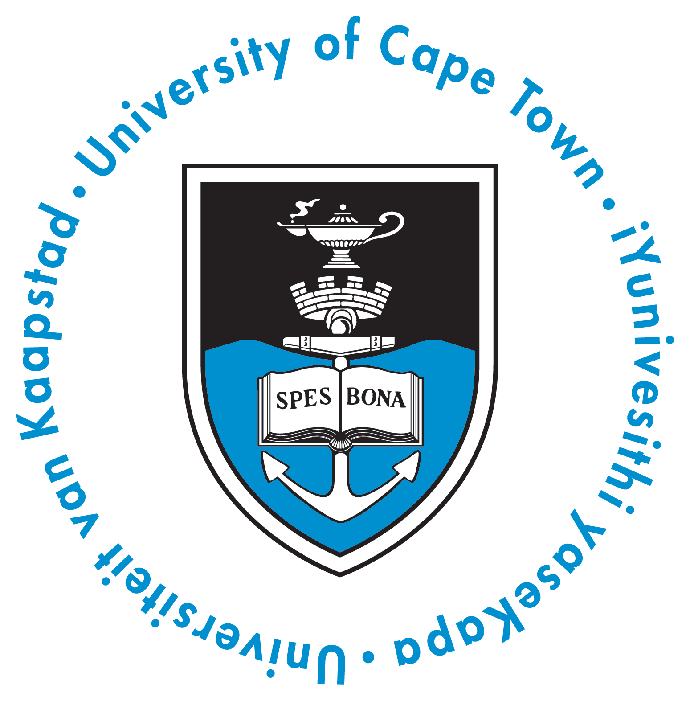
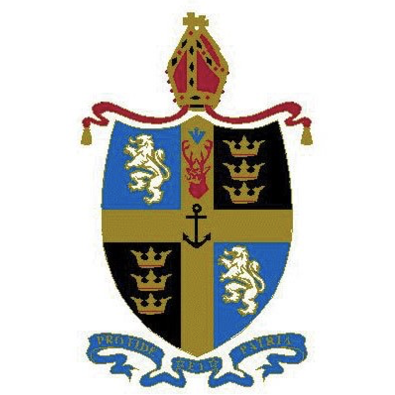

---
title: Education
layout: default
filename: education
--- 
<h1>Education</h1>

<h2>BSc(Eng) Mechatronics</h2>

2016 - 2019

  Summary of UCT things.

  <a href="resources/UCT_Transcript_StefanDominicus.pdf" target="_blank">Academic Results<small>UCT Transcript</small></a>

<h2>Bishops Diocesan College</h2>

2003 - 2015

  I was privilaged to attend Bishops for 13 years, from grade R to matric. In my grade 7 year, I was selected as Depute Head of Bramely House, and in grade 12 I was elected as Head of Mallett House, Capitain of Cycling, and one of two senior students in charge of the Audio Visual Department.

<h3>Awards & Achievements</h3>

  I started playing the trumpet in 2007, and in 2011 I was awarded a <b>Bishops Music Scholarship</b> for the remainder of my schooling. Over the course of my five years of highschool, I was awarded <b>Full Colours for Leadership, Academics, Music, Drama, & Cycling</b>. When I matriculated in 2015, I achieved <b>7 distinctions and an 87% agregate</b>. My matric results are linked below.

  <a href="resources/MatricCertificate_StefanDominicus.pdf" target="_blank">Academic Results<small>NSC Certificate</small></a>

<h3>Edinburgh Fringe Festival</h3>

  In 2012, and again in 2015, I was part of the production team responsible for two plays performed at the Edinburgh Fringe Festival (Biloxi Blues, and Cold Stone Jug respectively). The Edinburgh Fringe Festival is one of the most highly acclaimed drama and culture festivals in the world. Aside from being an exciting travel experience, these two trips taught me about working to a very tight schedule in an unfamiliar location, and about managing a team to overcome unforeseen setbacks.

  <a href="https://www.edfringe.com" target="_blank">Edinburgh Fringe<small>Check out their website</small></a>

<h3>Chile Exchange</h3>

  In 2013, I was selected to take part in a two-month student exchange to Curicó, Chile. While in Chile, I stayed with a host family and attended Orchard College High School. I could speak barely any Spanish, so I joined some of the grade 3 and 4 classes, where I helped the younger kids improve their English.

